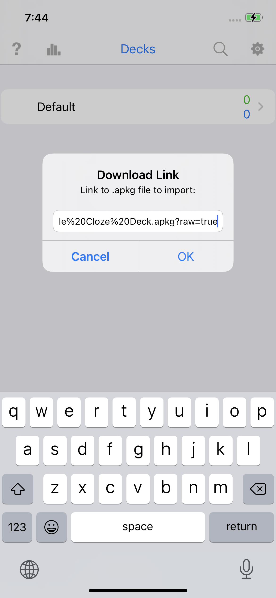
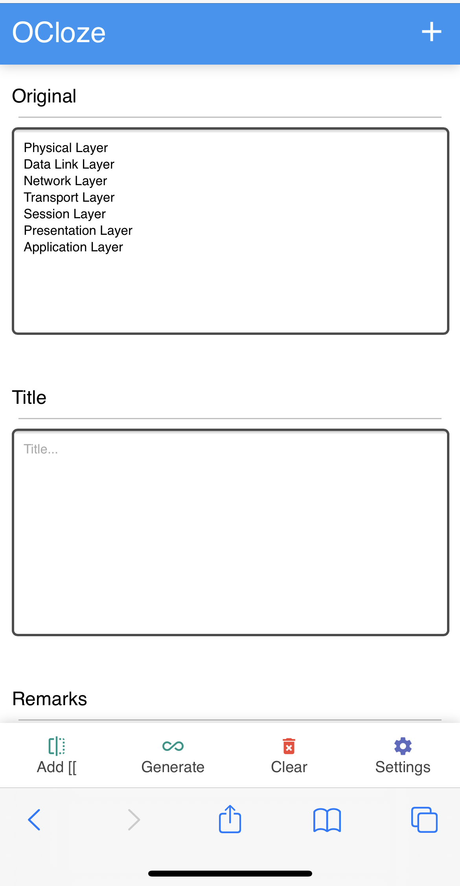
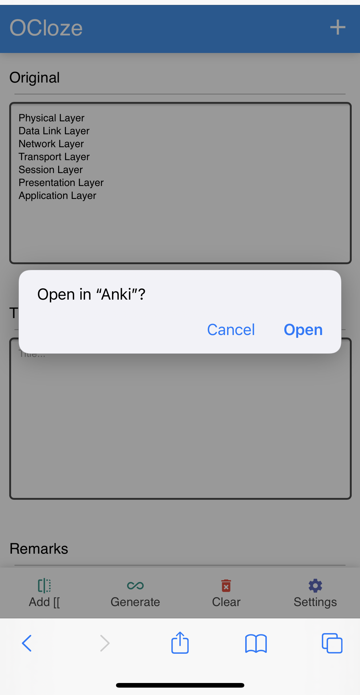
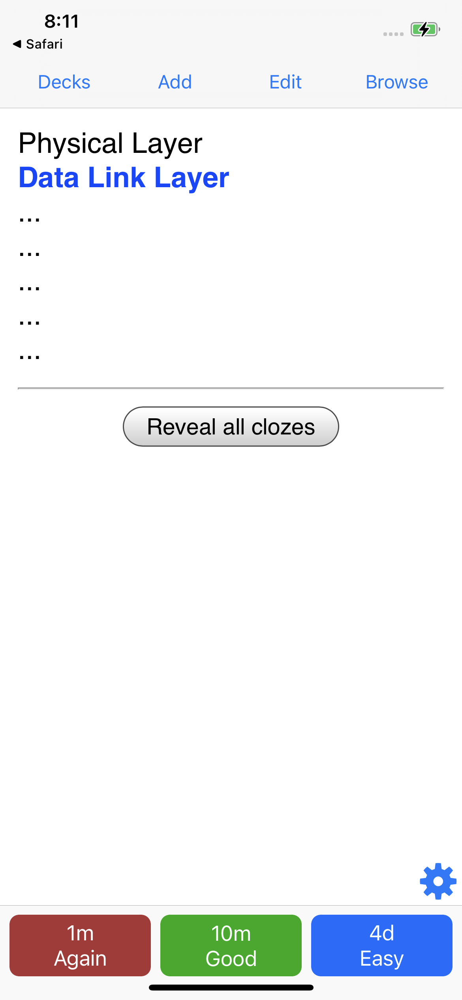

# Cloze Overlapping notes generation
1. Download this [sample deck](https://github.com/krmanik/ankidroid-js-addon/blob/main/Sample%20deck/Sample%20Cloze%20Deck.apkg?raw=true) into AnkiMobile.
It contains card template required by this addon.

2. Visit this page to generate card overlapping decks for AnkiMobile

- https://krmanik.github.io/AnkiMobile-Addons/ocloze

Note: It only works for AnkiMobile on iOS. For other platform view [ocloze](https://github.com/krmanik/ocloze).

3. Input text in Original field. There are two types of notes generation. 
- Text per line
    1. Paste list per line in `Original` field
    2. Click `Generate` then click `+`. It popup with `Open in "Anki"?`
    3. Click `Open` to add notes to Anki.

- `[[oc::]]` in text

    1. Paste paragraph in `Original` field
    2. Select words/sentences the click `Add` to add `[[oc1::some text]]` ... `[[oc2::some text]]`. 
    3. Click `Generate` then click `+`. It popup with `Open in Anki?`, click yes to add notes to Anki.

4. The deck name and cloze preferences can be changed in Settings

</img> </img> </img> </img>

# Licences
**cloze-overlapper** 
The deck and its template taken from [cloze-overlapper](https://github.com/glutanimate/cloze-overlapper) developed by Glutanimate. Its python code converted to javascript. Support work of [Glutanimate](https://www.patreon.com/glutanimate). 
[Click here to support Glutanimate's work](https://glutanimate.com/support-my-work/) 
AGPL-3.0 License

**[ocloze](https://github.com/krmanik/ocloze)** 
Copyright (c) 2021 Mani  
AGPL-3.0 License